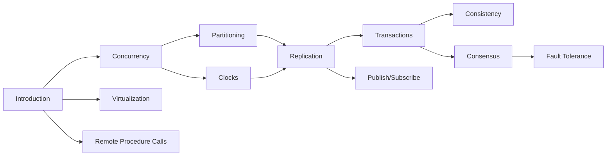

# Distributed Systems: A Guided Introduction

The widespread adoption of distributed systems in the modern software space has
posed numerous challenges to programmers seeking to build correct and scalable
applications. Unfortunately, opinions on how to approach such tasks vary wildly,
and easily accessible resources (blogs, articles, etc.) tend to offer little in
the way of rigorous discussion and depth of understanding. This tends to result
in a great deal of confusion and insecurity among software engineers looking to
enrich their skillsets to meet the demands of modern organizations.

Equally challenging is the prevalence of software professionals who possess a
superficial understanding of so-called "best practices" and "design patterns"
which ostensibly enable programmers without a strong background in fundamental
computing sciences or distributed systems principles to incidentally produce
software that is correct, reliable, and scalable. These designs are often an
attempt to emulate large software companies with complex requirements highly
specific to that organization's practices and pool of engineering resources.
Such systems are rarely appropriate outside of those contexts, and contribute
toward software that is poorly understood and difficult to maintain.

The task of the modern software engineer is thus twofold: First to design systems
which meet established correctness and performance requirements to serve users
and secondly, to combat the general trend toward building hypercomplex systems
in favor of those which are cost-effective and simple to maintain. What eludes
many earnest programmers is how exactly they might educate themselves in order
to better fulfill their obligations.

It is my opinion that the only antidote to the hype, marketing, misconceptions,
and general chaos of distributed systems is a rigorous treatment of the facts.

This guide is a collection of carefully curated resources and an organized plan
to work through them. I hope that it may help you along your journey.

## Who is the Intended Audience?

The resources contained in this guide are more suitable for intermediate to
advanced programmers with _some_ experience working in distributed systems. The
guide was written specifically for engineers at the mid to senior level without
much (or any) formal computer science education who seeking to eschew buzzwords
and approach distributed systems from first principles.

Those who have had a formal treatment of distributed systems or have worked in
large technology companies may benefit less from this guide.

## How to use this Guide

The guide is organized into broad topics in distributed systems. Each of these
topics includes recommended and optional reading and exercises if applicable.
Occasionally, certain materials will be listed as prerequisites. This is not a
hard-and-fast rule, but in most cases the subsequent material will be more
approachable than if you had not gone through the background material.

Whenever possible, freely available resources are provided.

### How to Approach these Resources

The recommended readings are intended to be read with intent and focus. It is
unlikely they will serve much value if lightly skimmed or read casually. These
resources are often an authoritative body of work on a subject, and may take a
little while to get through. Nevertheless, it is important to do your best to
engage with the material; an unfortunate peculiarity with distributed systems
is that academic publications or commercial whitepapers contain the bulk of the
advanced practical knowledge engineers would be looking for.

Optional readings are usually to provide context or real-world examples of some
topic. These can be read for enjoyment, but are most often excellent resources
to bring up in a discussion with your study group or team.

### Books

There are two recommendations for self-contained books:

1. [Designing Data-Intensive Applications](https://dataintensive.net/) by Martin Kleppman

Designing Data-Intensive Applications is an incredible resource on distributed
systems, and contains an enormous abundance of references that can be explored
afterwards. Most senior+ software engineers would benefit from this book.

2. [Distributed Systems](https://www.distributed-systems.net/index.php/books/ds4/) by Van Steen and Tanenbaum

Distributed Systems is a more traditional textbook on the subject. The coverage
is somewhat more general than DDIA, and is slightly more modern. This book is
available for free from author's website.

## Recommended Study Plan

The following is a recommended plan of attack for covering each module. This
approach is one of many, and can be modified to suit the tastes of the reader.
Deviating _too_ much is ill-advised, as some topics (such as transactions)
depend on previous material.

## Suggestions?

If you've identified a mistake, please file [an error](https://github.com/BeautifulTovarisch/ds-guided-intro/issues/new?assignees=&labels=&projects=&template=error.md&title=%5BError%5D) describing the issue.

If you have a suggestion for a resource I should add, please file a [suggestion](https://github.com/BeautifulTovarisch/ds-guided-intro/issues/new?assignees=&labels=&projects=&template=suggestion.md&title=%5BSuggestion%5D)
with a link to the resource and a brief justification for why you feel it ought
to be included. **Please note** that resources that do not align with the goals
of this repository will not be considered.
