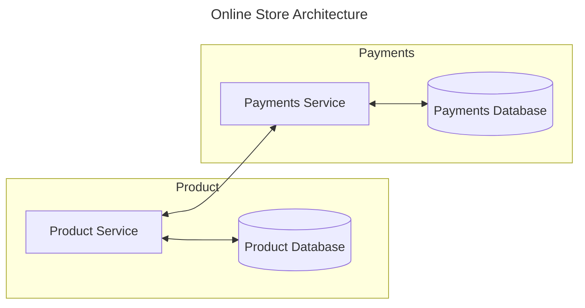

# RPC Lab

The purpose of this lab is to gain familiarity with a modern RPC tool. The gRPC
framework is used to build a straightforward API. Learning objectives include:

- Experience working with gRPC
- Introduction to binary serialization (Protobuf)
- Developing your own opinion of gRPC vs "traditional" REST API development

You will need to consult the [gRPC](https://grpc.io/docs/) documentation to
complete the tasks in this lab.

## Getting Started

Several tools and software packages are required to complete this lab:

- [Go](https://go.dev/doc/install)
- [Node.js](https://nodejs.org/en/download/package-manager)
- [Sqlite](https://www.sqlite.org/download.html)

Test that your `node.js` installation is working correctly:

```bash
cd product

npm start
```

Test that `go` is installed and you are able to fetch dependencies:

```bash
cd payments

go get
go run .
```

Finally, ensure that sqlite is able to create the payments database:

```bash
cd payments

sqlite3 payments.db
```

## Overview

In this lab, you will be developing two microservices for a fictional online
storefront. These services will be built with Google's gRPC framework. Below is
a high-level diagram of the services.



In order to better simulate working with microservices in the field, the two
services are written using different technology stacks. The `product` API is
written with Node.js and the `payments` API with Go. A deep understanding of
these languages/runtimes is not necessary to complete the lab.

### Foreword

The requirements for this assignment are **intentionally underspecified**.

This lab is largely open-ended to mimic a realistic working environment. Often
times there is no clear correct answer, and decisions about an API's design can
have unforeseen consequences. Unfortunately, this is the ambiguous reality most
software professionals face. It is important at each step to think carefully
about the implications of your choices and be able to justify them, even if you
are uncertain whether your decision is the best one.

## Requirements

You have been tasked with building a system to support an online storefront.
In particular, you are responsible for building services that process payments
and manage the product catalog. This system has several requirements:

    - Products can be added to the catalog
    - Products can be queried by category
    - Multiple products can be purchased at once
    - Payments can be aggregated by product
    - A report of the most successful products can be generated on-demand

## The Product API

This service is written with Node.js. The product catalog is stored in a mock
database designed to simulate interactions with a document store. Take care, as
this database is in-memory, and will not persist on application restart.

Modify the `product.proto` and `server.js` files to build a service which meets
the above requirements. Two modules, `db` and `logger` are provided for you.

You may find the following documentation helpful:

    - [Node.js](https://nodejs.org/docs/latest/api/)
    - [Node gRPC Docs](https://grpc.io/docs/languages/node/basics/)

## The Payments API

This API is written in Go. Those without prior experience with Go may find this
part of the lab difficult. If you find that this is the case, feel free to skip
this portion of the assignment and come back at a later time. You should still
consider designing the schema to accommodate the requirements.

Modify the `payments.proto` and `main.go` files to build a service which meets
the above requirements. Two modules, `db` and `logger`, have been provided for
you.

See the following documentation for more information:

    - [Sql Package](https://pkg.go.dev/database/sql#Open)
    - [Go gRPC Docs](https://grpc.io/docs/languages/go/basics/)

## Hints

- Think carefully about failure modes early on
- Consider how you might test your APIs (normal HTTP requests won't work!)
- It may be easier to integrate the services end to end with a simpler API than
  to try to build out everything at once.
