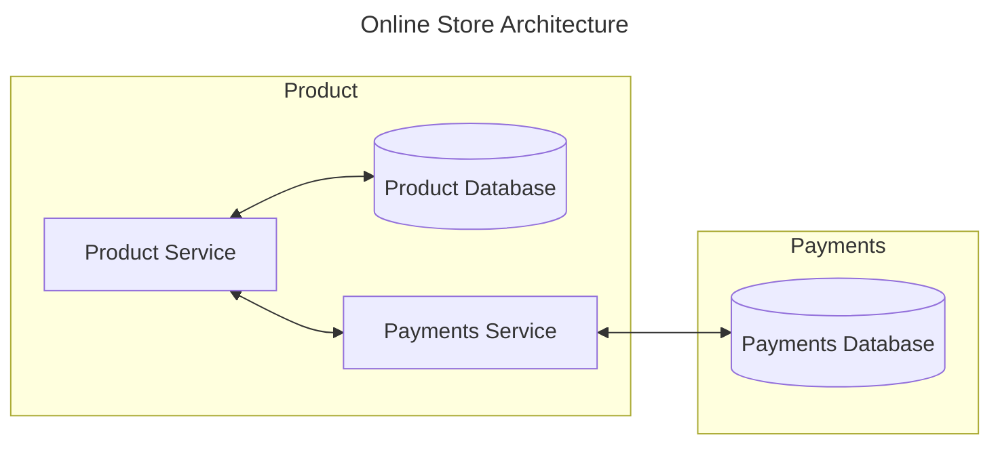

# RPC Lab

The purpose of this lab is to gain familiarity with a modern RPC tool. The gRPC
framework is used to build a straightforward API. Learning objectives include:

- Experience working with gRPC
- Introduction to binary serialization (Protobuf)
- Developing your own opinion of gRPC vs "traditional" REST API development

You will need to consult the [gRPC](https://grpc.io/docs/) documentation to
complete the tasks in this lab.

## Getting Started

Several tools and software packages are required to complete this lab:

- [Go](https://go.dev/doc/install)
- [Node.js](https://nodejs.org/en/download/package-manager)
- [Sqlite](https://www.sqlite.org/download.html)

Test that your `node.js` installation is working correctly:

```bash
cd product

npm start
```

Test that `go` is installed and you are able to fetch dependencies:

```bash
cd payments

go get
go run .
```

Finally, ensure that sqlite is able to create the payments database:

```bash
cd payments

sqlite3 payments.db
```

## Overview

In this lab, you will be developing two microservices for a fictional online
storefront. These services will be built with Google's gRPC framework. Below is
a high-level diagram of the services.


